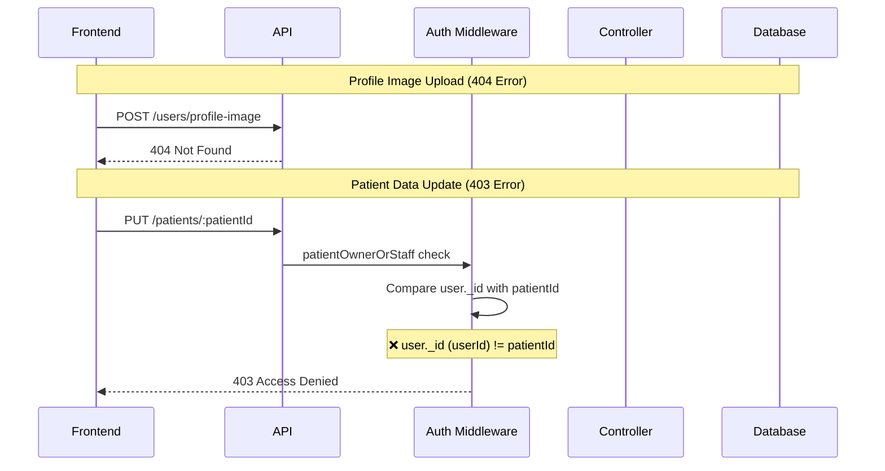
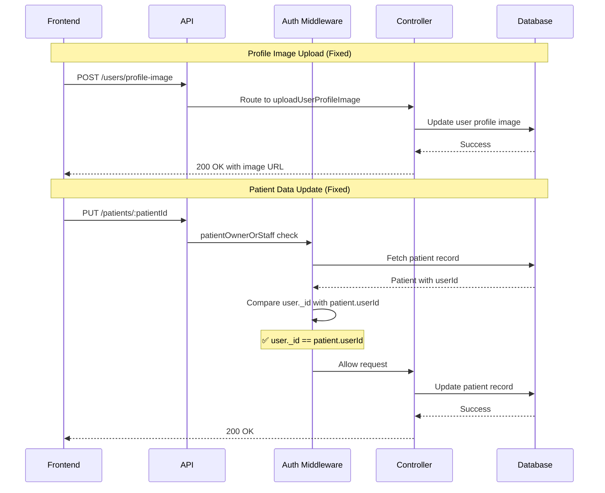

# Design Document

## Overview

This design addresses three critical authorization and routing issues that prevent patients from managing their profiles:

1. **Missing Profile Image Upload Route**: Frontend calls `/users/profile-image` but backend only has `/users/upload-image`
2. **Incorrect Authorization for Patient Data Fetching**: The `userOwnerOrStaff` middleware compares the authenticated user's ID with the `userId` parameter, but for patients, it should compare with the patient record's `userId` field
3. **Incorrect Authorization for Patient Data Updates**: The `patientOwnerOrStaff` middleware compares the authenticated user's ID with the patient ID parameter, but it should compare with the patient record's `userId` field

The solution involves:
- Adding an alias route for profile image uploads
- Fixing the `patientOwnerOrStaff` middleware to properly validate patient ownership
- Ensuring all patient-related endpoints use correct authorization logic

## Architecture

### Current Flow (Broken)



### Fixed Flow



## Components and Interfaces

### 1. Backend Routes (userRoutes.ts)

**Current State:**
```typescript
router.post('/upload-image', uploadSingle('profileImage'), uploadUserProfileImage);
```

**Required Change:**
Add an alias route to maintain backward compatibility:
```typescript
// Existing route
router.post('/upload-image', uploadSingle('profileImage'), uploadUserProfileImage);

// Add alias route for frontend compatibility
router.post('/profile-image', uploadSingle('profileImage'), uploadUserProfileImage);
```

### 2. Auth Middleware (auth.ts)

**Current Implementation (Broken):**
```typescript
export const patientOwnerOrStaff = (patientIdField: string = 'id') => {
  return (req: Request, res: Response, next: NextFunction): void => {
    const authReq = req as unknown as AuthenticatedRequest;
    
    // Staff and admin can access all patient data
    if (['admin', 'dentist', 'staff'].includes(authReq.user.role)) {
      next();
      return;
    }

    // Patients can only access their own data
    if (authReq.user.role === 'patient') {
      const patientId = req.params[patientIdField] || req.body[patientIdField];
      // ❌ PROBLEM: Comparing user._id with patientId
      // user._id is the userId, patientId is the patient record ID
      if (authReq.user._id.toString() === patientId) {
        next();
      } else {
        res.status(403).json({
          success: false,
          message: 'Access denied. Patients can only access their own data.'
        });
      }
      return;
    }

    res.status(403).json({
      success: false,
      message: 'Access denied. Insufficient permissions.'
    });
  };
};
```

**Fixed Implementation:**
```typescript
export const patientOwnerOrStaff = (patientIdField: string = 'id') => {
  return async (req: Request, res: Response, next: NextFunction): Promise<void> => {
    const authReq = req as unknown as AuthenticatedRequest;
    
    if (!authReq.user) {
      res.status(401).json({
        success: false,
        message: 'Access denied. User not authenticated.'
      });
      return;
    }

    // Staff and admin can access all patient data
    if (['admin', 'dentist', 'staff'].includes(authReq.user.role)) {
      next();
      return;
    }

    // Patients can only access their own data
    if (authReq.user.role === 'patient') {
      try {
        const patientId = req.params[patientIdField] || req.body[patientIdField];
        
        // ✅ SOLUTION: Fetch the patient record and compare userId
        const patient = await Patient.findById(patientId);
        
        if (!patient) {
          res.status(404).json({
            success: false,
            message: 'Patient not found.'
          });
          return;
        }

        // Compare the authenticated user's ID with the patient's userId
        if (patient.userId && patient.userId.toString() === authReq.user._id.toString()) {
          next();
          return;
        } else {
          res.status(403).json({
            success: false,
            message: 'Access denied. Patients can only access their own data.'
          });
          return;
        }
      } catch (error) {
        console.error('Patient ownership check error:', error);
        res.status(500).json({
          success: false,
          message: 'Internal server error during access control check.'
        });
        return;
      }
    }

    res.status(403).json({
      success: false,
      message: 'Access denied. Insufficient permissions.'
    });
  };
};
```

### 3. Frontend Service (userService.ts)

**Current Implementation:**
```typescript
export const uploadProfileImage = async (file: File): Promise<{ profileImage: string }> => {
  const formData = new FormData();
  formData.append('profileImage', file);
  
  const response = await api.post<ApiResponse<{ profileImage: string }>>('/users/profile-image', formData, {
    headers: {
      'Content-Type': 'multipart/form-data',
    },
  });
  return response.data.data;
};
```

**No Change Required** - The frontend is already calling the correct endpoint. We just need to add the route on the backend.

## Data Models

### User Model
```typescript
interface IUser {
  _id: ObjectId;
  firstName: string;
  lastName: string;
  email: string;
  role: 'admin' | 'dentist' | 'staff' | 'patient';
  profileImage?: string;
  // ... other fields
}
```

### Patient Model
```typescript
interface IPatient {
  _id: ObjectId;
  userId: ObjectId;  // Reference to User._id
  firstName: string;
  lastName: string;
  email: string;
  phone: string;
  dateOfBirth: Date;
  gender: 'male' | 'female' | 'other';
  address: {
    street: string;
    city: string;
    state: string;
    zipCode: string;
    country: string;
  };
  emergencyContact: {
    name: string;
    phone: string;
    relationship: string;
  };
  medicalHistory: {
    allergies: string[];
    conditions: string[];
    medications: string[];
    notes: string;
  };
  // ... other fields
}
```

### Key Relationship
- A User with role='patient' has a corresponding Patient record
- Patient.userId references User._id
- When a patient accesses their data, we compare:
  - `authenticatedUser._id` (the user ID from JWT)
  - `patient.userId` (the user ID stored in the patient record)

## Error Handling

### Current Errors

1. **404 Error on Profile Image Upload**
   - **Cause**: Route `/users/profile-image` doesn't exist
   - **Solution**: Add alias route
   - **Expected Response**: 200 OK with image URL

2. **403 Error on Patient Data Fetch**
   - **Cause**: `userOwnerOrStaff` middleware incorrectly validates ownership
   - **Solution**: Already works correctly (compares user._id with userId parameter)
   - **Expected Response**: 200 OK with patient data

3. **403 Error on Patient Data Update**
   - **Cause**: `patientOwnerOrStaff` middleware compares user._id with patientId instead of patient.userId
   - **Solution**: Fetch patient record and compare user._id with patient.userId
   - **Expected Response**: 200 OK with updated patient data

### Error Response Format

All authorization errors should follow this format:
```typescript
{
  success: false,
  message: string  // User-friendly error message
}
```

### Status Codes
- **200**: Success
- **401**: Not authenticated (no token or invalid token)
- **403**: Forbidden (authenticated but not authorized)
- **404**: Resource not found
- **500**: Internal server error

## Testing Strategy

### Unit Tests

1. **Auth Middleware Tests**
   ```typescript
   describe('patientOwnerOrStaff middleware', () => {
     it('should allow staff to access any patient data', async () => {
       // Test with staff user accessing any patient
     });

     it('should allow admin to access any patient data', async () => {
       // Test with admin user accessing any patient
     });

     it('should allow patient to access their own data', async () => {
       // Test with patient user accessing their own patient record
     });

     it('should deny patient accessing another patient\'s data', async () => {
       // Test with patient user trying to access different patient record
     });

     it('should return 404 if patient record not found', async () => {
       // Test with invalid patient ID
     });
   });
   ```

2. **Route Tests**
   ```typescript
   describe('Profile Image Upload Routes', () => {
     it('should accept POST to /users/upload-image', async () => {
       // Test existing route
     });

     it('should accept POST to /users/profile-image', async () => {
       // Test new alias route
     });

     it('should upload image and return URL', async () => {
       // Test successful upload
     });
   });
   ```

### Integration Tests

1. **Patient Profile Flow**
   ```typescript
   describe('Patient Profile Management', () => {
     it('should allow patient to fetch their profile', async () => {
       // Login as patient
       // Fetch patient data via /patients/user/:userId
       // Verify success
     });

     it('should allow patient to update their profile', async () => {
       // Login as patient
       // Update patient data via PUT /patients/:id
       // Verify success
     });

     it('should allow patient to upload profile image', async () => {
       // Login as patient
       // Upload image via POST /users/profile-image
       // Verify success
     });
   });
   ```

2. **Authorization Tests**
   ```typescript
   describe('Patient Data Authorization', () => {
     it('should prevent patient from accessing another patient\'s data', async () => {
       // Login as patient A
       // Try to fetch patient B's data
       // Verify 403 error
     });

     it('should prevent patient from updating another patient\'s data', async () => {
       // Login as patient A
       // Try to update patient B's data
       // Verify 403 error
     });
   });
   ```

### Manual Testing Checklist

- [ ] Patient can log in successfully
- [ ] Patient can view their profile page without errors
- [ ] Patient can view their settings page without errors
- [ ] Patient can upload a profile picture
- [ ] Patient can update their personal information
- [ ] Patient can update their medical history
- [ ] Patient can update their emergency contact
- [ ] Patient cannot access another patient's data
- [ ] Staff can access any patient's data
- [ ] Admin can access any patient's data

## Implementation Notes

### Order of Implementation

1. **Add Profile Image Route Alias** (Quick Win)
   - Add one line to `backend/src/routes/userRoutes.ts`
   - Test immediately with frontend

2. **Fix patientOwnerOrStaff Middleware** (Critical)
   - Update `backend/src/middleware/auth.ts`
   - Make function async
   - Add database query to fetch patient record
   - Compare user._id with patient.userId
   - Add proper error handling

3. **Test All Patient Endpoints**
   - Verify GET /patients/user/:userId works
   - Verify PUT /patients/:id works
   - Verify profile image upload works

### Performance Considerations

The `patientOwnerOrStaff` middleware now makes a database query to fetch the patient record. This adds a small overhead, but:

1. **Acceptable Trade-off**: Security and correctness are more important than the minimal performance impact
2. **Caching Opportunity**: Could cache patient-user mappings if this becomes a bottleneck
3. **Query Optimization**: The query is simple (findById) and should be fast with proper indexing

### Security Considerations

1. **No Security Regression**: The fix makes authorization more secure by properly validating ownership
2. **Maintains Separation**: Patients still cannot access other patients' data
3. **Staff Access Preserved**: Staff and admin can still access all patient data as needed
4. **Error Messages**: Don't leak sensitive information in error messages

### Backward Compatibility

1. **Route Alias**: Adding `/users/profile-image` doesn't break existing `/users/upload-image` route
2. **Middleware Change**: The fix doesn't change the middleware signature, only the implementation
3. **Frontend**: No frontend changes required

## Deployment Considerations

### Database Migrations
No database migrations required - this is purely a code fix.

### Environment Variables
No new environment variables required.

### Rollback Plan
If issues arise:
1. Remove the `/users/profile-image` route alias
2. Revert the `patientOwnerOrStaff` middleware to synchronous version
3. Frontend will show errors again, but system remains stable

### Monitoring
After deployment, monitor:
1. 403 error rates on patient endpoints (should decrease)
2. 404 error rates on profile image uploads (should decrease to zero)
3. Response times on patient endpoints (should remain similar)
4. Error logs for any new authorization issues
