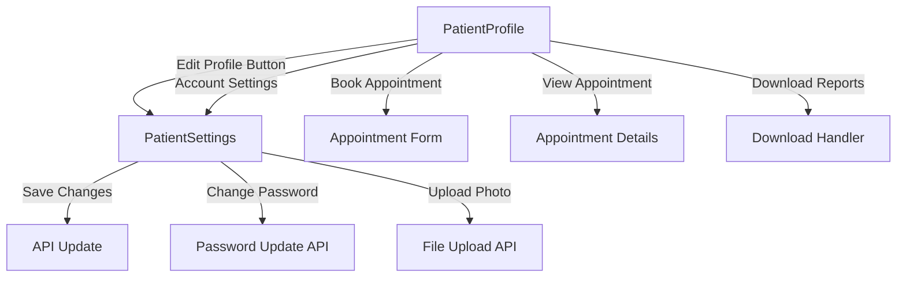

# Design Document

## Overview

This design document outlines the approach to ensure all buttons and interactive elements on patient and doctor profile pages function correctly. The system currently has multiple profile-related pages:

- **PatientProfile.tsx**: Read-only view of patient information with quick actions
- **PatientSettings.tsx**: Editable patient settings with multiple sections
- **Profile.tsx**: General profile wrapper that uses ProfileSettings
- **ProfileSettings.tsx**: General settings for all user roles including dentists

The design focuses on:
1. Fixing non-functional buttons by implementing proper event handlers
2. Adding navigation using React Router's `useNavigate` hook
3. Ensuring form submissions work with proper API integration
4. Implementing file upload functionality for profile pictures
5. Adding proper loading states and user feedback
6. Ensuring password change functionality works correctly

## Architecture

### Component Structure

```
┌─────────────────────────────────────────┐
│         App.tsx (Routing)               │
│  - /profile → PatientProfile            │
│  - /settings → PatientSettings          │
└─────────────────────────────────────────┘
                    │
        ┌───────────┴───────────┐
        │                       │
┌───────▼──────────┐   ┌───────▼──────────┐
│ PatientProfile   │   │ PatientSettings  │
│ (Read-only)      │   │ (Editable)       │
│                  │   │                  │
│ - View info      │   │ - Edit personal  │
│ - Quick actions  │   │ - Edit medical   │
│ - Appointments   │   │ - Change pwd     │
└──────────────────┘   └──────────────────┘
        │                       │
        └───────────┬───────────┘
                    │
        ┌───────────▼───────────┐
        │   Shared Services     │
        │                       │
        │ - patientService      │
        │ - userService         │
        │ - appointmentService  │
        └───────────────────────┘
```

### Navigation Flow



## Components and Interfaces

### 1. PatientProfile Component

**Purpose**: Display patient information in read-only mode with quick action buttons

**Button Implementations Needed**:

```typescript
// Navigation buttons
const navigate = useNavigate();

// Edit Profile button
const handleEditProfile = () => {
  navigate('/settings');
};

// Book Appointment button
const handleBookAppointment = () => {
  navigate('/appointments/create');
};

// View Appointment button
const handleViewAppointment = (appointmentId: string) => {
  navigate(`/appointments/${appointmentId}`);
};

// Account Settings button
const handleAccountSettings = () => {
  navigate('/settings');
};

// Download Reports button (placeholder for future implementation)
const handleDownloadReports = () => {
  toast.info('Report download feature coming soon');
};

// Camera icon for profile picture
const handleProfilePictureClick = () => {
  navigate('/settings');
  // Optionally scroll to profile picture section
};
```

**State Management**:
- No form state needed (read-only)
- Loading state for data fetching
- Error state for API failures

### 2. PatientSettings Component

**Purpose**: Allow patients to edit their personal information, medical history, and account settings

**Button Implementations Needed**:

```typescript
const navigate = useNavigate();
const [loading, setLoading] = useState(false);
const [uploadingImage, setUploadingImage] = useState(false);

// Profile picture upload
const handleProfilePictureUpload = async (e: React.ChangeEvent<HTMLInputElement>) => {
  const file = e.target.files?.[0];
  if (!file) return;
  
  // Validate file size (5MB limit)
  if (file.size > 5 * 1024 * 1024) {
    setMessage({ type: 'error', text: 'File size must be less than 5MB' });
    return;
  }
  
  // Validate file type
  const validTypes = ['image/jpeg', 'image/jpg', 'image/png', 'image/gif'];
  if (!validTypes.includes(file.type)) {
    setMessage({ type: 'error', text: 'Please upload a valid image file (JPG, PNG, or GIF)' });
    return;
  }
  
  try {
    setUploadingImage(true);
    const result = await userService.uploadProfileImage(file);
    setMessage({ type: 'success', text: 'Profile picture updated successfully' });
    // Refresh user context to show new image
    await refreshUser();
  } catch (error: any) {
    setMessage({ type: 'error', text: error.message });
  } finally {
    setUploadingImage(false);
  }
};

// Form submission
const handleSubmit = async (e: React.FormEvent) => {
  e.preventDefault();
  setLoading(true);
  setMessage(null);
  
  try {
    const updateData = {
      ...formData,
      dateOfBirth: new Date(formData.dateOfBirth),
      gender: formData.gender as 'male' | 'female' | 'other',
      id: patient?.id
    };
    
    await patientService.updatePatient(patient?.id!, updateData);
    setMessage({ type: 'success', text: 'Profile updated successfully!' });
    
    // Auto-dismiss success message after 3 seconds
    setTimeout(() => setMessage(null), 3000);
  } catch (err: any) {
    setMessage({ type: 'error', text: err.message || 'Failed to update profile' });
  } finally {
    setLoading(false);
  }
};

// Password change
const handlePasswordChange = async (e: React.FormEvent) => {
  e.preventDefault();
  
  // Validation
  if (passwordData.newPassword !== passwordData.confirmPassword) {
    setMessage({ type: 'error', text: 'New passwords do not match' });
    return;
  }
  
  if (passwordData.newPassword.length < 8) {
    setMessage({ type: 'error', text: 'Password must be at least 8 characters long' });
    return;
  }
  
  setLoading(true);
  try {
    await authService.changePassword(
      passwordData.currentPassword,
      passwordData.newPassword
    );
    setMessage({ type: 'success', text: 'Password updated successfully' });
    setPasswordData({ currentPassword: '', newPassword: '', confirmPassword: '' });
    setShowPasswordFields(false);
    
    // Auto-dismiss after 3 seconds
    setTimeout(() => setMessage(null), 3000);
  } catch (error: any) {
    setMessage({ type: 'error', text: error.message || 'Failed to update password' });
  } finally {
    setLoading(false);
  }
};

// Add allergy
const handleAddAllergy = () => {
  if (newAllergy.trim()) {
    setFormData(prev => ({
      ...prev,
      medicalHistory: {
        ...prev.medicalHistory,
        allergies: [...prev.medicalHistory.allergies, newAllergy.trim()]
      }
    }));
    setNewAllergy('');
  }
};

// Remove allergy
const handleRemoveAllergy = (index: number) => {
  setFormData(prev => ({
    ...prev,
    medicalHistory: {
      ...prev.medicalHistory,
      allergies: prev.medicalHistory.allergies.filter((_, i) => i !== index)
    }
  }));
};

// Similar handlers for conditions
```

### 3. ProfileSettings Component (for Dentists)

**Purpose**: Allow dentists to edit their professional information

**Additional Fields**:
- Specialization
- License Number
- Bio

**Button Implementations**:
- Same as PatientSettings but with additional professional fields
- Profile picture upload with same validation
- Form submission includes professional data

## Data Models

### Patient Update Data
```typescript
interface PatientUpdateData {
  firstName: string;
  lastName: string;
  email: string;
  phone: string;
  dateOfBirth: Date;
  gender: 'male' | 'female' | 'other';
  address: {
    street: string;
    city: string;
    state: string;
    zipCode: string;
    country: string;
  };
  emergencyContact: {
    name: string;
    phone: string;
    relationship: string;
  };
  medicalHistory: {
    allergies: string[];
    conditions: string[];
    medications: string[];
    notes: string;
  };
}
```

### User Profile Update Data
```typescript
interface UpdateProfileData {
  firstName?: string;
  lastName?: string;
  phone?: string;
  dateOfBirth?: string;
  gender?: string;
  address?: {
    street?: string;
    city?: string;
    state?: string;
    zipCode?: string;
    country?: string;
  };
  specialization?: string;  // For dentists
  licenseNumber?: string;   // For dentists
  bio?: string;             // For dentists
}
```

### Password Change Data
```typescript
interface PasswordChangeData {
  currentPassword: string;
  newPassword: string;
  confirmPassword: string;
}
```

## Error Handling

### Client-Side Validation

1. **Form Validation**:
   - Required fields must be filled
   - Email format validation
   - Phone number format validation
   - Password strength validation (min 8 characters)
   - Password match validation

2. **File Upload Validation**:
   - File size limit: 5MB
   - Allowed types: JPG, JPEG, PNG, GIF
   - Display clear error messages for violations

3. **Input Sanitization**:
   - Trim whitespace from text inputs
   - Prevent duplicate entries in arrays (allergies, conditions)

### Server-Side Error Handling

1. **API Error Responses**:
   ```typescript
   try {
     await apiCall();
   } catch (error: any) {
     const errorMessage = error.response?.data?.message 
       || error.message 
       || 'An unexpected error occurred';
     setMessage({ type: 'error', text: errorMessage });
   }
   ```

2. **Network Errors**:
   - Display user-friendly messages
   - Suggest retry actions
   - Maintain form data on error

3. **Authentication Errors**:
   - Redirect to login on 401 errors
   - Clear invalid tokens
   - Preserve intended destination

### User Feedback

1. **Success Messages**:
   - Display for 3 seconds
   - Green color scheme
   - Checkmark icon
   - Auto-dismiss

2. **Error Messages**:
   - Display until dismissed
   - Red color scheme
   - Alert icon
   - Dismissible

3. **Loading States**:
   - Disable buttons during operations
   - Show spinner or loading text
   - Prevent duplicate submissions

## Testing Strategy

### Unit Tests

1. **Button Click Handlers**:
   - Test navigation calls with correct paths
   - Test form submission with valid data
   - Test form submission with invalid data
   - Test file upload with valid files
   - Test file upload with invalid files

2. **Validation Functions**:
   - Test email validation
   - Test phone validation
   - Test password validation
   - Test file size validation
   - Test file type validation

3. **State Management**:
   - Test form data updates
   - Test loading states
   - Test error states
   - Test message display and dismissal

### Integration Tests

1. **Navigation Flow**:
   - Test navigation from PatientProfile to PatientSettings
   - Test navigation to appointment pages
   - Test back navigation

2. **Form Submission**:
   - Test successful profile update
   - Test failed profile update
   - Test password change flow
   - Test profile picture upload

3. **API Integration**:
   - Mock API responses
   - Test success scenarios
   - Test error scenarios
   - Test loading states

### Manual Testing Checklist

1. **PatientProfile Page**:
   - [ ] Edit Profile button navigates to settings
   - [ ] Book Appointment button navigates to appointment form
   - [ ] View button on appointments navigates to details
   - [ ] Account Settings button navigates to settings
   - [ ] Download Reports button shows appropriate message
   - [ ] Camera icon navigates to settings

2. **PatientSettings Page**:
   - [ ] Camera icon opens file picker
   - [ ] Valid image uploads successfully
   - [ ] Invalid image shows error
   - [ ] Large file shows error
   - [ ] Form saves successfully with valid data
   - [ ] Form shows errors with invalid data
   - [ ] Add allergy button works
   - [ ] Remove allergy button works
   - [ ] Add condition button works
   - [ ] Remove condition button works
   - [ ] Enter key adds allergy/condition
   - [ ] Change Password button shows fields
   - [ ] Cancel button hides password fields
   - [ ] Password change validates correctly
   - [ ] Password change submits successfully
   - [ ] Success messages display and auto-dismiss
   - [ ] Error messages display and are dismissible
   - [ ] Loading states show during operations
   - [ ] Buttons disable during operations

3. **ProfileSettings Page (Dentist)**:
   - [ ] All patient settings features work
   - [ ] Professional fields save correctly
   - [ ] Specialization updates
   - [ ] License number updates
   - [ ] Bio updates

## Implementation Notes

### React Router Integration

All navigation should use the `useNavigate` hook from React Router v6:

```typescript
import { useNavigate } from 'react-router-dom';

const navigate = useNavigate();
navigate('/path');
```

### Auth Context Integration

Password change should use the `useAuth` hook:

```typescript
import { useAuth } from '../../hooks/useAuth';

const { changePassword } = useAuth();
await changePassword(currentPassword, newPassword);
```

### Toast Notifications

Use react-hot-toast for temporary notifications:

```typescript
import toast from 'react-hot-toast';

toast.success('Profile updated successfully');
toast.error('Failed to update profile');
toast.info('Feature coming soon');
```

### File Upload

Use FormData for file uploads:

```typescript
const formData = new FormData();
formData.append('profileImage', file);

await api.post('/users/profile-image', formData, {
  headers: { 'Content-Type': 'multipart/form-data' }
});
```

### Loading States

Implement proper loading states to prevent duplicate submissions:

```typescript
const [loading, setLoading] = useState(false);

const handleSubmit = async () => {
  if (loading) return; // Prevent duplicate submissions
  setLoading(true);
  try {
    await apiCall();
  } finally {
    setLoading(false);
  }
};

<Button disabled={loading} isLoading={loading}>
  {loading ? 'Saving...' : 'Save Changes'}
</Button>
```

### Auto-Dismiss Messages

Success messages should auto-dismiss after 3 seconds:

```typescript
setMessage({ type: 'success', text: 'Success!' });
setTimeout(() => setMessage(null), 3000);
```

### Keyboard Support

Support Enter key for adding items:

```typescript
<Input
  onKeyPress={(e) => {
    if (e.key === 'Enter') {
      e.preventDefault();
      handleAddItem();
    }
  }}
/>
```
