# DentalPro Manager 🦷

**A modern, full-stack dental clinic management system** named DentalPro that provides a comprehensive web interface for managing patients and medical appointments. It includes a Patient Dashboard for booking appointments, managing medical files, and electronic payments.

Live Demo: _Coming Soon (Deploying on Vercel)_  
(Currently running on localhost:5173 – Demo available upon request)

## 🚀 Features

- **Secure Authentication** (Login / Register with JWT)
- **Patient Dashboard**
  - Book & reschedule dental appointments with clinic selection
  - View and update treatment plans
  - Manage invoices & online payments
  - Insurance information management
  - Chat/messages with clinic staff
  - Notification system for upcoming appointments
- **Appointments Management**
  - List of upcoming and recent appointments with details (date, time, service, dentist, status)
  - Quick actions: View, Complete, Cancel, Reschedule
  - Search by patient, service, or date
- **Fully Responsive** – Works perfectly on mobile, tablet, and desktop
- **Clean & Modern UI** with Tailwind CSS and intuitive booking progress

## 🛠️ Tech Stack

### Frontend


### Backend


### Tools
- ESLint • React Icons • Zod (planning to add)

## 📸 Screenshots

### Login Page
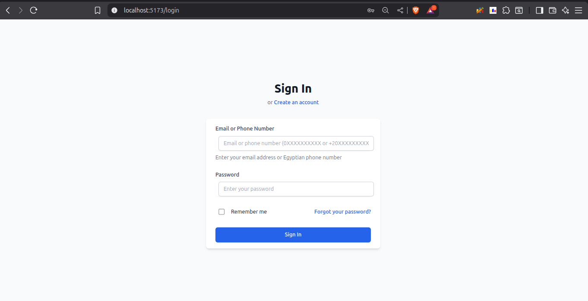

### Patient Dashboard (Mobile View)
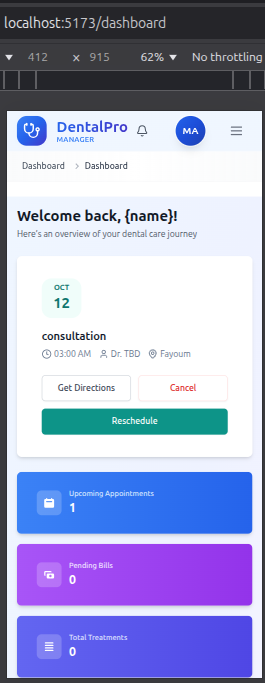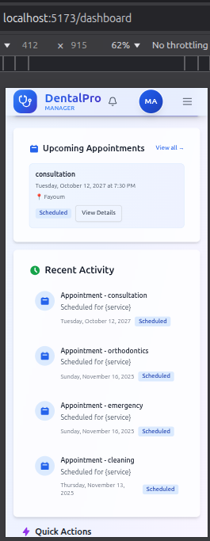,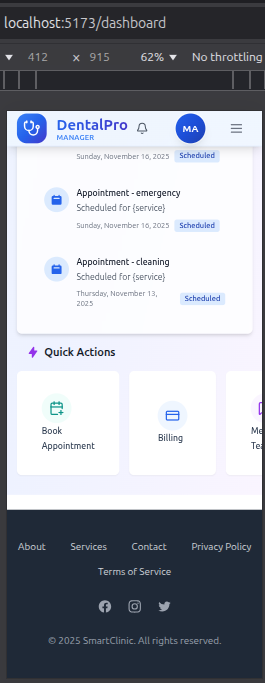

### Appointments List (Mobile View)
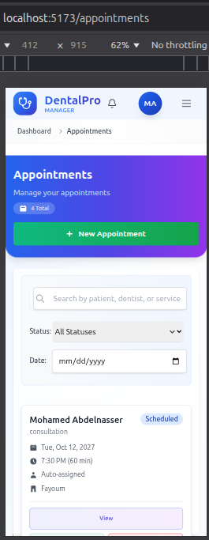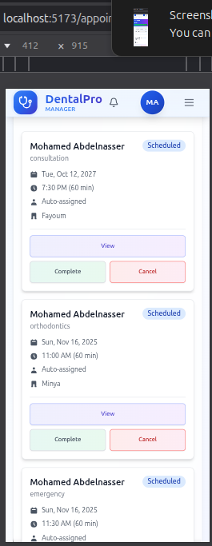

### Create Appointment (Mobile View)
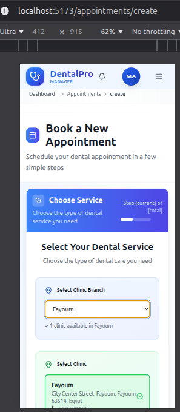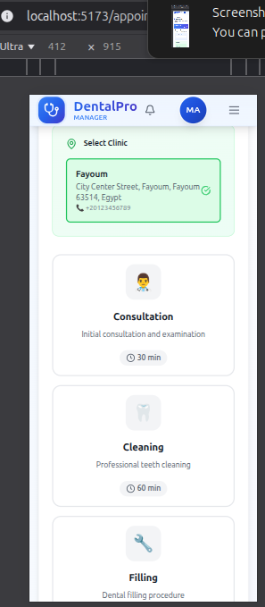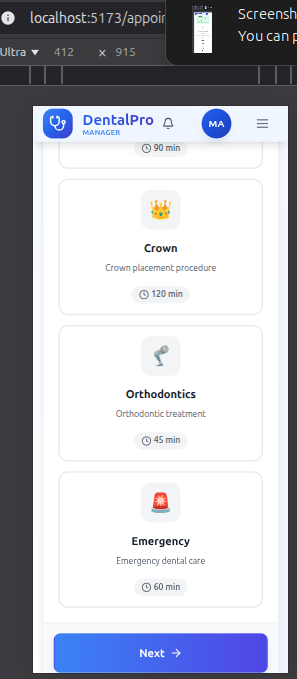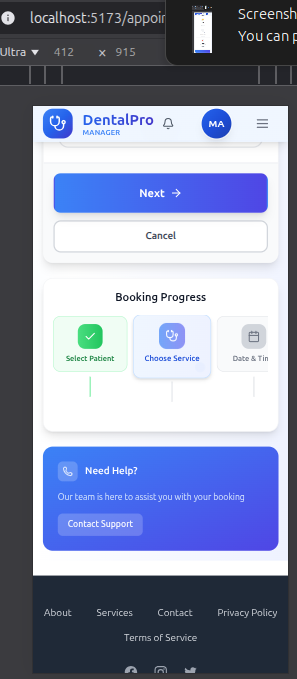

### Dashboard (Desktop View)
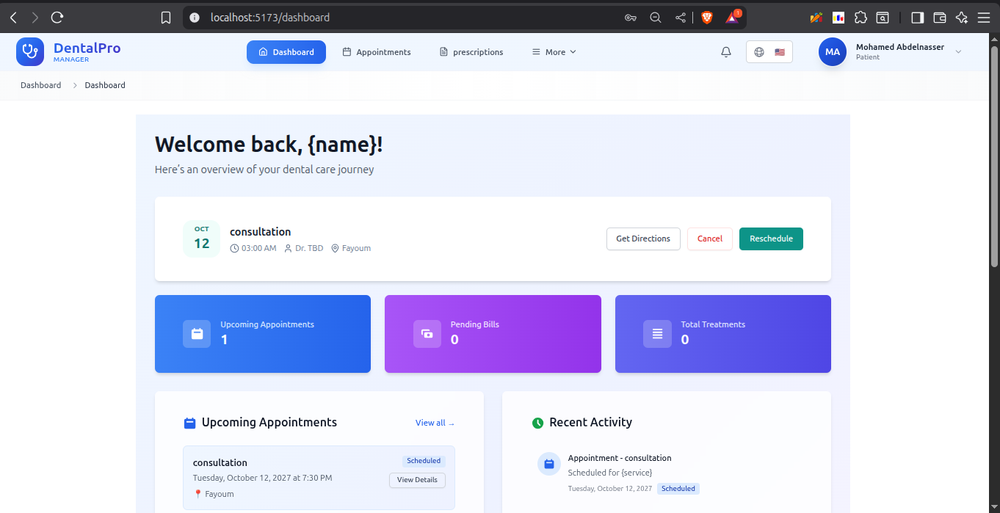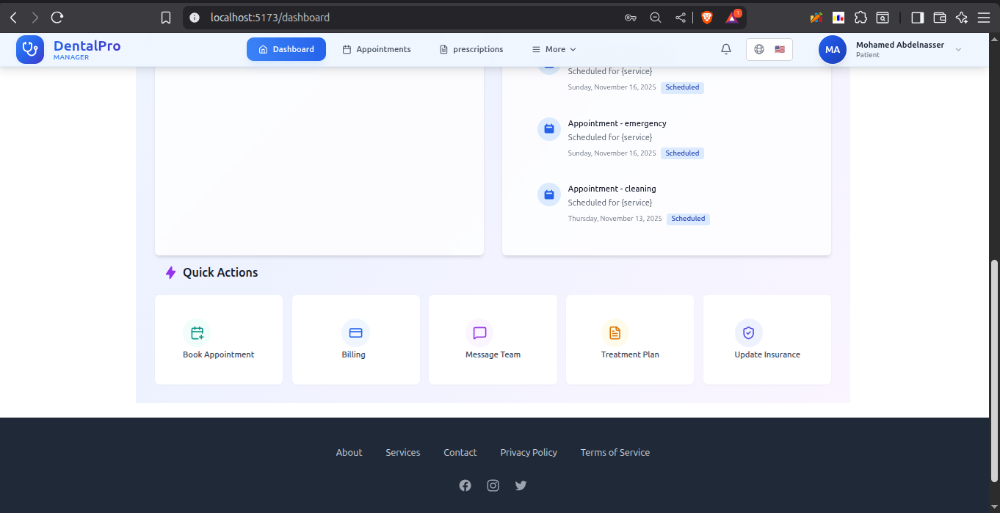

### Appointments Table (Desktop View)
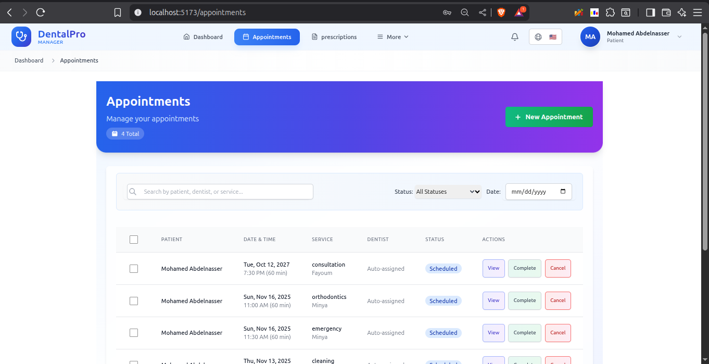

### Create Appointment Services (Desktop View)
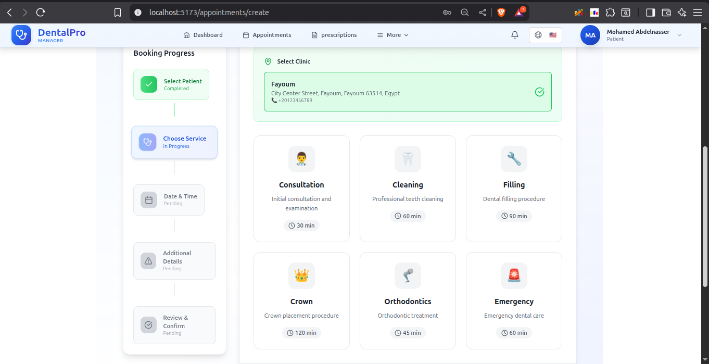

## 🚧 Status: In Active Development
- 85% Frontend Complete (Responsive design fully implemented)
- Backend API 100% Functional
- Payment Integration (in progress with Paymob/Stripe)
- Admin/Doctor Panel (next phase)

## 🔜 Upcoming Features
- Doctor/Admin dashboard for managing patients and schedules
- Stripe/Paymob payment gateway
- Email/SMS notifications
- Deployment on Vercel/Netlify

## 🏃‍♂️ How to Run Locally

```bash
git clone https://github.com/mohammedabdelnaser3/dentapro-eg.git
cd dentapro-eg

# Frontend
cd client
npm install
npm run dev

# Backend (if in separate folder)
cd server
npm install
npm start
